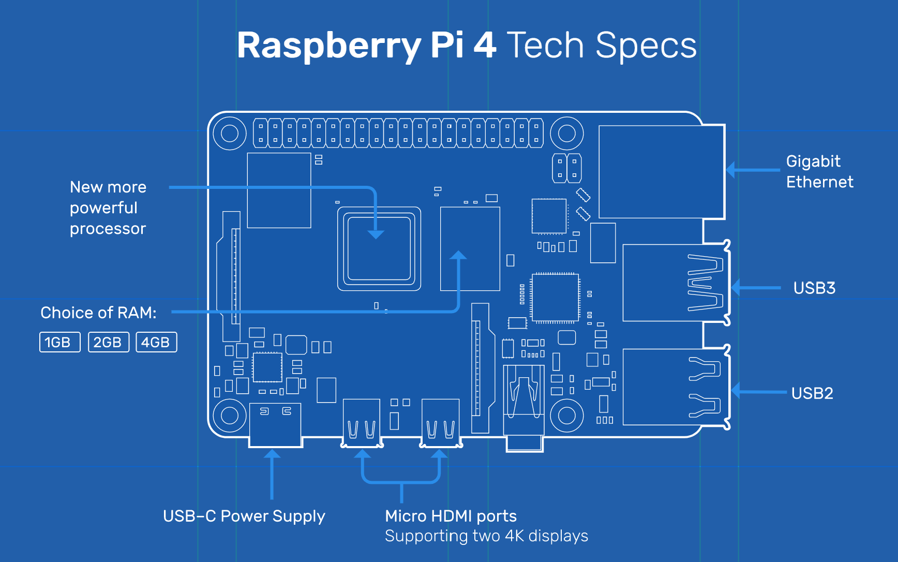
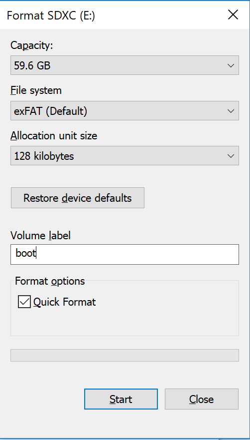

# Raspberry Pi 4 Model B - Assemble and Install OS

In this article I will document how I configured my new Raspberry Pi 4 without only my laptop and one networking cable and then connect the Raspberry Pi to an existing WiFi network.

I will then configure the Pi to run dotnet core 3.1

Note that some of these instructions will be performed from a Windows 10 machine. If your machine is not a windows machine then some steps will be different.

## Parts needed

- RaspberryPi from Canary, etc.
-- [What you need](https://projects.raspberrypi.org/en/projects/raspberry-pi-setting-up/2)
- MicroSD card 4 GB to 64 GB
-- Note if you get 64 or larger you will need to format it differently
-- SD Card official formatting tool: [SD Memory Card Formatter](https://www.sdcard.org/downloads/formatter/index.html)
- Networking cable
- Laptop or computer to download software and to connect to the Pi later.

## Raspberry Pi 4 Specs

The Raspberry Pi 4 Model B board layout can be seen below:



**Specifications:**
- Broadcom BCM2711, Quad core Cortex-A72 (ARM v8) 64-bit SoC @ 1.5GHz
- 1GB, 2GB or 4GB LPDDR4-3200 SDRAM (depending on model)
- 2.4 GHz and 5.0 GHz IEEE 802.11ac wireless, Bluetooth 5.0, BLE
- Gigabit Ethernet
- 2 USB 3.0 ports; 2 USB 2.0 ports.
- Raspberry Pi standard 40 pin GPIO header (fully backwards compatible with previous boards)
- 2 × micro-HDMI ports (up to 4kp60 supported)
- 2-lane MIPI DSI display port
- 2-lane MIPI CSI camera port
- 4-pole stereo audio and composite video port
- H.265 (4kp60 decode), H264 (1080p60 decode, 1080p30 encode)
- OpenGL ES 3.0 graphics
- Micro-SD card slot for loading operating system and data storage
- 5V DC via USB-C connector (minimum 3A*)
- 5V DC via GPIO header (minimum 3A*)
- Power over Ethernet (PoE) enabled (requires separate PoE HAT)
- Operating temperature: 0 – 50 degrees C ambient
* A good quality 2.5A power supply can be used if downstream USB peripherals consume less than 500mA in total.

## General Configuration for basic RaspberryPi setup

1. Assemble RaspberryPi per instructions from your kit.
1a. Do **not** boot the PI until later
2. Download the OS from: [OS Download](https://www.raspberrypi.org/downloads/raspbian/) ~435 MB - 2.5 Gig depending on the version you choose.
3. Insert MicroSD or SD adapter with MicroSD into your computer to begin formatting
4. Right click on the drive and click format
5. Select File system type. If greater than 32 GB select exFAT
6. Give the drive/volume a label. I choose to call mine "boot"

7. Unzip the OS download from step 2. At the time of this writing the OS was kernel version 4.19 released in September 2019. 2019-09-26-raspbian-buster-full.zip
8. Extract the image to your SD card [Installing Images](https://www.raspberrypi.org/documentation/installation/installing-images/README.md)
- If you do not already have an image burning tool download baleanEtcher
9. Your SD card should now have a bootable image

Decide if you are going to do a headless install or a "typical machine"...

### "Typical" machine with keyboard, mouse and monitor
1. Right click on the SD card in Windows Explorer and select Eject
2. Remove SD card from your machine
3. Insert the microSD card into your Raspberry Pi
4. Plug in the hardware devices
5. Power up the Pi


### Configure the Pi for headless access

If you do not have a spare monitor, keyboard and mouse you can still configure and be up and running with a headless setup.
[Headless Setup](./HeadlessSetup.md)


## Complete basic setup of the Pi

1. Type: ```sudo raspi-config```
2. Using your keyboard and arrows navigate to ```Network options```
3. Select Wi-fi
4. Type in the SSID id/name that you want your Raspberry Pi to connect to
5. Type in the WiFi password
6. Select finish to exit the configuration
7. Test the wifi by pinging a well-known address or website like www.google.com, etc.
8. Type: ```sudo raspi-config```
9. Select update to get the latest updates for your Pi over the WiFi connection
10. Select finish to exit the configuration

Additional instructions for SD Card and download: [here](https://projects.raspberrypi.org/en/projects/raspberry-pi-setting-up/3)

Official Raspberry Pi setup instructions

- [Instructions](https://projects.raspberrypi.org/en/projects/raspberry-pi-setting-up)